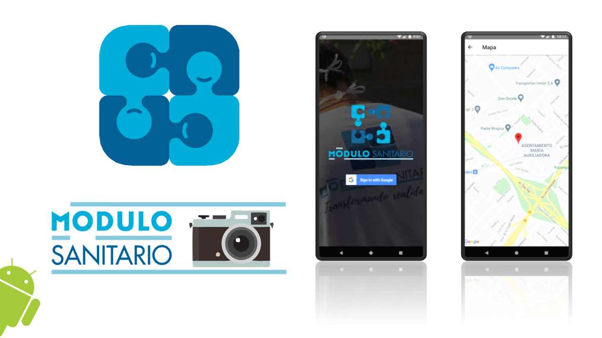

# Modulo Sanitario Imagenes: Frontend

## Documentación
Se puede encontrar disponible la documentación en el link principal del servidor backend (https://modulo-sanitario-imagenes-db.herokuapp.com/). Se puede obtener código de referencia de forma muy sencilla desde la interfaz de POSTMAN que sale en ese mismo link.

## Demo
<a href="https://vimeo.com/651792169">

 </a>
